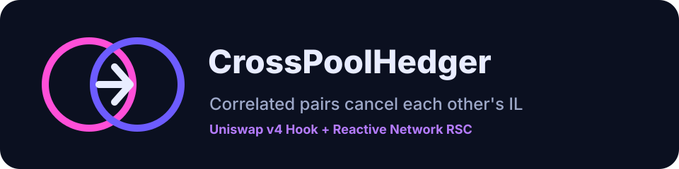
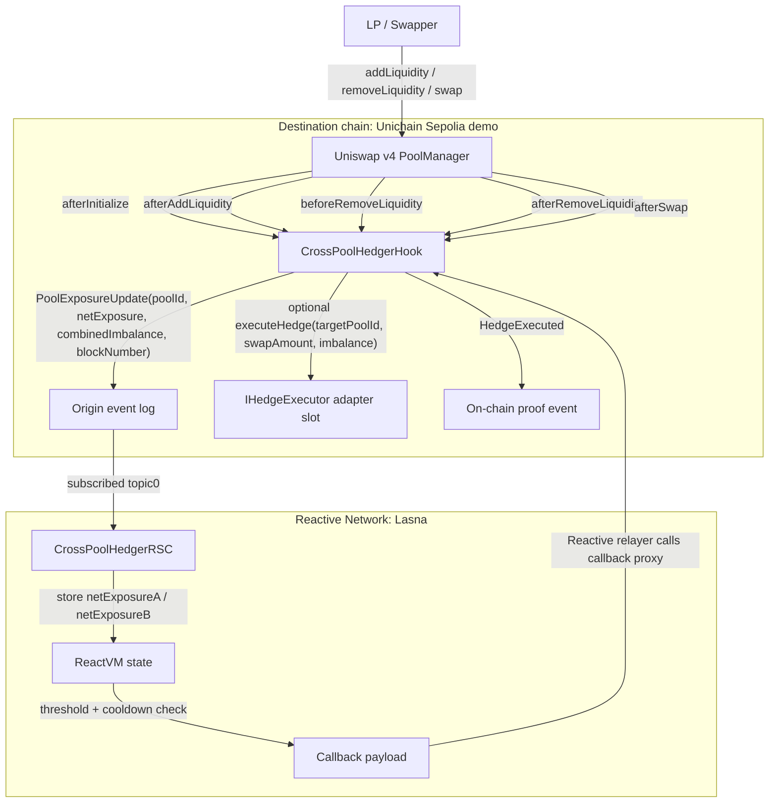
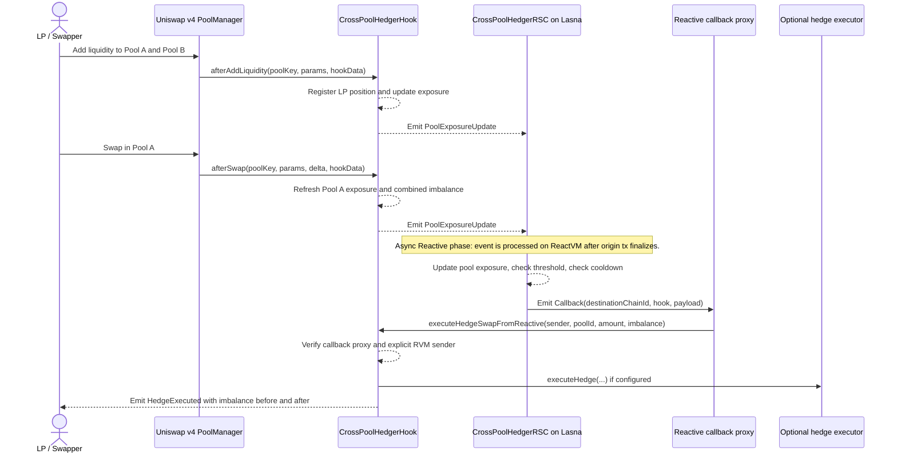
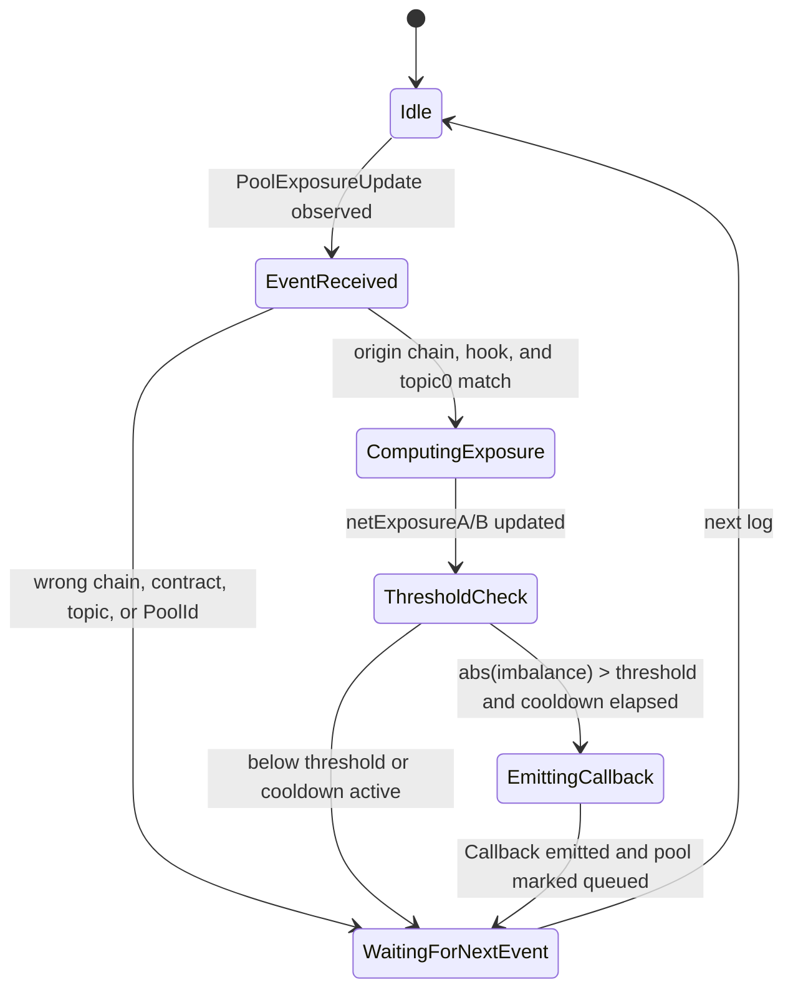
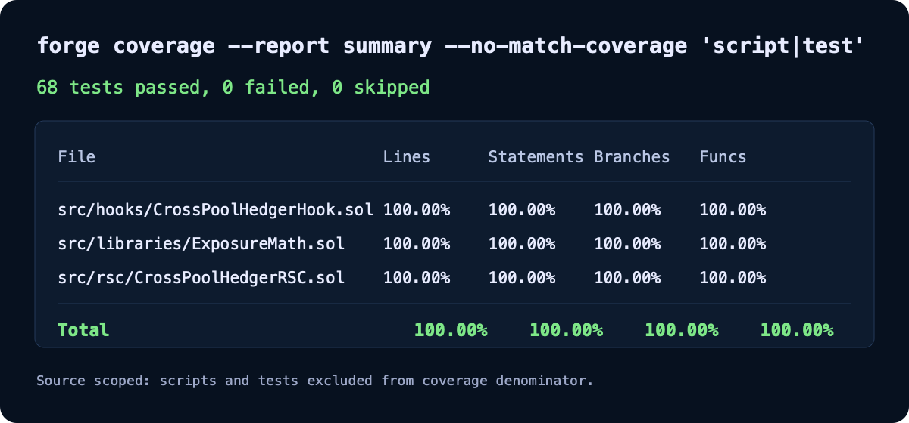

# 🛡️ CrossPoolHedger Hook



*Correlated pairs cancel each other's impermanent loss.*


---

CrossPoolHedger is a Uniswap v4 hook that coordinates liquidity-provider exposure across two correlated pools, such as ETH/USDC and ETH/stETH. Instead of treating impermanent loss as an isolated pool-local event, the hook emits pool exposure updates and lets a Reactive Smart Contract maintain the combined cross-pool imbalance. When the imbalance exceeds a threshold, the RSC queues a callback that instructs the hook to reduce the target pool's recorded exposure through a controlled hedge path. Built for the UHI9 Hookathon — Impermanent Loss & Yield Systems.

> ⚛️ **Reactive Network Integration**  
> CrossPoolHedger Hook is powered by Reactive Smart Contracts (RSCs) deployed on Reactive Network. RSCs autonomously monitor on-chain events from Uniswap v4 and trigger callbacks without keepers, bots, or manual intervention. In this project, the RSC subscribes to `PoolExposureUpdate` events, maintains exposure for both tracked pools on ReactVM, computes combined imbalance, and calls back into `executeHedgeSwapFromReactive(address,bytes32,int256,int256)` when hedging conditions are met.

## Table of Contents

- [The Problem](#the-problem)
- [The Solution](#the-solution)
- [Architecture](#architecture)
- [Core Components](#core-components)
- [Reactive Network Integration](#reactive-network-integration)
- [Demo Run](#demo-run)
- [Test Coverage](#test-coverage)
- [Local Development](#local-development)
- [Security Considerations](#security-considerations)
- [Known Limitations & Future Work](#known-limitations--future-work)
- [Contributing & License](#contributing--license)
- [Acknowledgements](#acknowledgements)

## The Problem

Impermanent loss is triggered by market movement, but LP tooling still treats it as a single-pool accounting problem. When ETH moves, every ETH-denominated pool feels the same underlying price event at the same time, yet LPs in ETH/USDC, ETH/stETH, ETH/DAI, and ETH/WBTC manage their drift independently. That isolation leaves naturally offsetting exposure unused.

Prior UHI hooks explored important parts of the LP design space: FlexFee and volatility-fee variants adjusted swap pricing, Gainswap-like designs experimented with asymmetric payoff surfaces, xtreamly explored active liquidity behavior, and Idle Liquidity Yield Hook / YieldSync moved idle capital toward yield. Those designs improve a single pool or a single reserve path, but they do not maintain trust-minimized state across two correlated pools and act on the combined IL signal.

CrossPoolHedger fills that gap. It uses one Uniswap v4 hook address across both pools and one RSC that observes both event streams, making cross-pool IL coordination a first-class on-chain mechanism instead of an off-chain keeper strategy.

**CrossPoolHedger Hook solves this by measuring exposure in two correlated pools, netting the combined imbalance, and letting Reactive Network trigger a hedge callback only when that imbalance is economically meaningful.**

## The Solution

The hook registers a pair of correlated Uniswap v4 pools and tracks a pool-level exposure scalar for each one. LP additions establish liquidity and baseline price context; swaps update current price context; removals reduce registered exposure. Every meaningful state transition emits `PoolExposureUpdate(bytes32,int256,int256,uint256)` for the RSC.

The RSC is the cross-pool state machine. It receives exposure events from the destination chain, stores Pool A and Pool B exposure on ReactVM, recomputes `netExposureA + netExposureB`, and emits a Reactive callback when threshold and cooldown checks pass. The hook then verifies both the callback proxy and the explicit RVM sender before reducing the target pool's imbalance and emitting `HedgeExecuted`.

1. The owner registers two valid PoolIds that share the same CrossPoolHedger hook address.
2. LPs add liquidity to Pool A and Pool B, and the hook records liquidity, entry price, and pool exposure.
3. A trader swaps against one pool, causing `afterSwap` to refresh that pool's net exposure.
4. The hook emits `PoolExposureUpdate` with the changed pool exposure and the combined cross-pool imbalance.
5. The RSC observes the event, updates ReactVM state for the correct PoolId, and checks threshold plus cooldown.
6. If a hedge is warranted, the RSC emits a callback payload for `executeHedgeSwapFromReactive`.
7. The hook authenticates the callback, reduces the target pool's exposure toward zero, optionally calls a hedge executor, and emits `HedgeExecuted`.

> ⚖️ **Risk Accounting:** No external counterparty absorbs LP losses in v1; correlated LP positions hedge each other internally, while the hook's hedge path reduces the recorded net system imbalance and any optional execution cost is paid by the configured hedge reserve / executor path.

## Architecture

### System Overview Diagram



### User Journey Diagram



### RSC State Transition Diagram



## Core Components

### CrossPoolHedgerHook.sol

`CrossPoolHedgerHook` is the Uniswap v4 hook that registers two correlated PoolIds, tracks LP liquidity and pool exposure, emits RSC-readable events, and executes authenticated hedge callbacks.

| Function | Visibility | Description |
| --- | --- | --- |
| `getHookPermissions()` | `public pure` | Declares the exact Uniswap v4 callbacks enabled by the hook address flags. |
| `registerPoolPair(bytes32,bytes32)` | `external` | Owner-only registration for the two tracked pool IDs. |
| `setCallbackProxy(address)` | `external` | Owner-only update for the Reactive destination callback proxy. |
| `setReactiveSender(address)` | `external` | Owner-only update for the explicit RVM sender identity. |
| `setHedgeExecutor(address)` | `external` | Optional adapter slot for production hedge execution. |
| `setHedgeParams(int256,uint256)` | `external` | Owner-only threshold and cooldown configuration. |
| `combinedImbalance()` | `public view` | Returns `netExposure(poolA) + netExposure(poolB)`. |
| `quoteHedge(int256)` | `public view` | Computes the target pool and half-imbalance hedge amount. |
| `executeHedgeSwapFromReactive(address,bytes32,int256,int256)` | `external` | Reactive callback entrypoint protected by proxy and sender checks. |
| `executeHedgeSwapDirect(bytes32,int256,int256)` | `external` | Direct demo/admin-style hedge path restricted to `reactiveSender`. |
| `computeNetExposure(uint160,uint160,uint128)` | `external pure` | Exposes `ExposureMath.netExposure` for tests and external verification. |

| Variable | Type | Description |
| --- | --- | --- |
| `owner` | `address` | Admin that configures pool pair, callback auth, hedge params, and ownership. |
| `callbackProxy` | `address` | Required `msg.sender` for Reactive callbacks. |
| `reactiveSender` | `address` | Explicit RVM sender argument expected inside callback payload. |
| `hedgeExecutor` | `address` | Optional adapter invoked after internal hedge accounting. |
| `poolAId` | `bytes32` | First tracked correlated pool. |
| `poolBId` | `bytes32` | Second tracked correlated pool. |
| `hedgeThreshold` | `int256` | Minimum absolute imbalance required before RSC should queue a hedge. |
| `cooldownBlocks` | `uint256` | Minimum block gap between hedge executions. |
| `lastHedgeBlock` | `uint256` | Last block where the hook executed a hedge. |
| `callbackDebt` | `uint256` | Hook-level callback payment runbook support. |
| `exposureState` | `mapping(PoolId => ExposureState)` | Pool liquidity, baseline price, last price, net exposure, and update block. |
| `positions` | `mapping(PoolId => mapping(address => LPPosition))` | Per-LP registered liquidity and entry context. |

Hook permissions used:

- ❌ `beforeInitialize`
- ✅ `afterInitialize`
- ❌ `beforeAddLiquidity`
- ✅ `afterAddLiquidity`
- ✅ `beforeRemoveLiquidity`
- ✅ `afterRemoveLiquidity`
- ❌ `beforeSwap`
- ✅ `afterSwap`
- ❌ `beforeDonate`
- ❌ `afterDonate`
- ❌ Return-delta permissions

### CrossPoolHedgerRSC.sol

`CrossPoolHedgerRSC` is the Reactive Smart Contract deployed on Lasna that subscribes to hook exposure events, maintains two-pool exposure state, and emits the callback that drives autonomous hedge execution.

| Function | Visibility | Description |
| --- | --- | --- |
| `configureSubscription()` | `external` | Subscription-admin function for explicitly configuring the Lasna filter if constructor setup is unavailable. |
| `react(LogRecord)` | `external` | ReactVM entrypoint that filters logs, updates exposure state, and emits callbacks. |
| `computeHedgeParams(int256)` | `external view` | Returns the target PoolId and swap amount for a given imbalance. |

| Variable | Type | Description |
| --- | --- | --- |
| `ORIGIN_CHAIN_ID` | `uint256 immutable` | Source chain where the Uniswap v4 hook emits `PoolExposureUpdate`. |
| `DESTINATION_CHAIN_ID` | `uint256 immutable` | Destination chain where the callback should execute. |
| `HOOK_ADDRESS` | `address immutable` | Hook address subscribed to and used as callback destination. |
| `POOL_A_ID` | `bytes32 immutable` | Pool A identifier accepted by the RSC. |
| `POOL_B_ID` | `bytes32 immutable` | Pool B identifier accepted by the RSC. |
| `CALLBACK_GAS_LIMIT` | `uint64 immutable` | Gas limit included in Reactive callback events. |
| `CALLBACK_SENDER` | `address immutable` | Explicit sender value encoded into the callback payload. |
| `hedgeThreshold` | `int256` | Absolute threshold for hedge callbacks. |
| `cooldownBlocks` | `uint256` | Minimum origin block gap between callbacks. |
| `netExposureA` | `int256` | Latest ReactVM exposure value for Pool A. |
| `netExposureB` | `int256` | Latest ReactVM exposure value for Pool B. |
| `lastImbalance` | `int256` | Last computed cross-pool imbalance. |
| `callbackQueued` | `mapping(bytes32 => bool)` | Per-pool duplicate callback guard. |

Subscription details:

- Event: `PoolExposureUpdate(bytes32,int256,int256,uint256)`
- Origin address: `HOOK_ADDRESS`
- Origin chain: configured at deployment; current Unichain Sepolia demo uses chain ID `1301`
- Topic0: `keccak256("PoolExposureUpdate(bytes32,int256,int256,uint256)")`
- Topic filters: `REACTIVE_IGNORE` for indexed PoolId and remaining topics, so both pools are captured by one subscription

Callback emitted:

```solidity
ICrossPoolHedger.executeHedgeSwapFromReactive(
    CALLBACK_SENDER,
    targetPoolId,
    swapAmount,
    currentImbalance
);
```

### ExposureMath.sol

`ExposureMath` contains the deterministic exposure and signed-adjustment helpers used by both the hook and the RSC.

| Function | Visibility | Description |
| --- | --- | --- |
| `netExposure(uint160,uint160,uint128)` | `internal pure` | Computes signed exposure from baseline price, current price, and total liquidity. |
| `abs(int256)` | `internal pure` | Returns the unsigned absolute value of a signed integer. |
| `reduceTowardZero(int256,int256)` | `internal pure` | Applies an adjustment without crossing through zero. |

| Variable | Type | Description |
| --- | --- | --- |
| `Q96` | `uint256 constant` | Fixed-point denominator for `sqrtPriceX96` drift scaling. |

### IHedgeExecutor.sol

`IHedgeExecutor` is an optional production adapter interface for connecting internal hedge accounting to an external execution route.

| Function | Visibility | Description |
| --- | --- | --- |
| `executeHedge(bytes32,int256,int256)` | `external` | Adapter hook called with target PoolId, swap amount, and imbalance snapshot. |

## Reactive Network Integration

### Why Reactive Network?

CrossPoolHedger needs one stateful actor to watch two pool event streams, retain exposure across events, and trigger a callback only when the combined imbalance is large enough. A keeper or Chainlink Automation job could poll the same data, but the trust boundary would move off-chain and the proof would depend on an operator's timing and correctness. Reactive Network lets the project express this as a deterministic on-chain event reaction: origin event, ReactVM state transition, callback event, destination execution.

### RSC Event Subscription

```solidity
// Event emitted by hook
event PoolExposureUpdate(
    bytes32 indexed poolId,
    int256 netExposure,
    int256 combinedImbalance,
    uint256 blockNumber
);

// Topic0 used for RSC subscription
bytes32 topic0 = keccak256("PoolExposureUpdate(bytes32,int256,int256,uint256)");
```

The RSC calls:

```solidity
service.subscribe(
    ORIGIN_CHAIN_ID,
    HOOK_ADDRESS,
    POOL_EXPOSURE_UPDATE_TOPIC,
    REACTIVE_IGNORE,
    REACTIVE_IGNORE,
    REACTIVE_IGNORE
);
```

This subscribes to the single hook address and leaves the indexed PoolId unfiltered, allowing the same RSC to observe both Pool A and Pool B.

### ReactVM Computation

ReactVM stores `netExposureA`, `netExposureB`, `lastImbalance`, `lastHedgeBlock`, and `callbackQueued[poolId]`. The `react()` function rejects logs from the wrong chain, contract, or topic, decodes the pool exposure event, updates only the matching pool, recomputes imbalance, and queues a callback if the absolute imbalance exceeds threshold and cooldown has elapsed.

```solidity
function react(LogRecord calldata log) external vmOnly {
    if (log.chain_id != ORIGIN_CHAIN_ID) return;
    if (log._contract != HOOK_ADDRESS) return;
    if (log.topic_0 != POOL_EXPOSURE_UPDATE_TOPIC) return;

    bytes32 poolId = bytes32(log.topic_1);
    (int256 poolNetExposure, int256 combinedImbalance, uint256 eventBlock) =
        abi.decode(log.data, (int256, int256, uint256));

    if (poolId == POOL_A_ID) netExposureA = poolNetExposure;
    else if (poolId == POOL_B_ID) netExposureB = poolNetExposure;
    else return;

    int256 currentImbalance = netExposureA + netExposureB;
    bool thresholdBreached = ExposureMath.abs(currentImbalance) > ExposureMath.abs(hedgeThreshold);
    bool cooldownElapsed = lastHedgeBlock == 0 || eventBlock > lastHedgeBlock + cooldownBlocks;
    if (!thresholdBreached || !cooldownElapsed || callbackQueued[poolId]) return;

    (bytes32 targetPoolId, int256 swapAmount) = _computeHedgeParams(currentImbalance);
    bytes memory payload = abi.encodeCall(
        ICrossPoolHedger.executeHedgeSwapFromReactive,
        (CALLBACK_SENDER, targetPoolId, swapAmount, currentImbalance)
    );

    emit Callback(DESTINATION_CHAIN_ID, HOOK_ADDRESS, CALLBACK_GAS_LIMIT, payload);
}
```

### Callback Flow

```text
[Unichain Sepolia] CrossPoolHedgerHook emits PoolExposureUpdate
    -> CrossPoolHedgerRSC detects event on Reactive Network Lasna
    -> react() executes on ReactVM and updates netExposureA / netExposureB
    -> RSC emits Callback(destinationChainId, hookAddress, calldata)
    -> Reactive Network relayer submits transaction through destination callback proxy
    -> Hook's executeHedgeSwapFromReactive() executes on Unichain Sepolia
    -> Hook emits HedgeExecuted(targetPool, swapAmount, imbalanceBefore, imbalanceAfter, blockNumber)
```

### Access Control

The destination hook uses the two-check Reactive auth pattern: `msg.sender` must be the configured callback proxy, and the explicit `sender` argument must match the configured RVM sender.

```solidity
function executeHedgeSwapFromReactive(
    address sender,
    bytes32 targetPoolId,
    int256 swapAmount,
    int256 imbalanceSnapshot
) external {
    _enterHedgeLock();
    if (msg.sender != callbackProxy || sender != reactiveSender) revert OnlyReactive();
    _executeHedge(targetPoolId, swapAmount, imbalanceSnapshot);
    _exitHedgeLock();
}
```

## Demo Run

The demo script tests the full lifecycle from local correctness, through destination hook deployment, demo pool setup, RSC deployment, callback reserve funding, origin exposure event emission, Lasna RVM processing, and destination callback execution. The current proof sequence confirms the origin `PoolExposureUpdate`, the Lasna RVM transaction that queued the Reactive callback, and the destination transaction that emitted `HedgeExecuted`.

### Deployed Contracts

| Contract | Address | Explorer |
| --- | --- | --- |
| CrossPoolHedgerHook | `0xe4b36d5b37b2903c4d4c3c36de78e23deb315740` | [🔗 View on Explorer](https://sepolia.uniscan.xyz/address/0xe4b36d5b37b2903c4d4c3c36de78e23deb315740) |
| CrossPoolHedgerRSC | `0x32ab29c684433db6d4099705e47a9053eec18aaa` | [🔗 Deployment tx on Lasna](https://lasna.reactscan.net/tx/0x363d086356b16e5a37e7171cfbeddcf0800cd2bc0a4301081185aaa2116c5b53) |
| Demo xETH | `0xe82e9c3a2ad2ff09e15350c7e42d74171d94d53c` | [🔗 View on Explorer](https://sepolia.uniscan.xyz/address/0xe82e9c3a2ad2ff09e15350c7e42d74171d94d53c) |
| Demo xUSDC | `0x7f372d605a8c0eea25ac553ce69baa55c54ac26b` | [🔗 View on Explorer](https://sepolia.uniscan.xyz/address/0x7f372d605a8c0eea25ac553ce69baa55c54ac26b) |
| Demo xstETH | `0x627271620d9359c14dd8fb8b6852fdb1ee3c9c6f` | [🔗 View on Explorer](https://sepolia.uniscan.xyz/address/0x627271620d9359c14dd8fb8b6852fdb1ee3c9c6f) |

Pool IDs:

| Pool | PoolId |
| --- | --- |
| Pool A | `0x6e5b3a139b4f7c9465b0c9412e3b3e9025fd13867b463164c6807e302620abb4` |
| Pool B | `0x46a5c16cf809a52ccb74ada30f1774c06829ea71f78f22d1f9df748269eb6481` |

### End-to-End Demo Steps

#### Step 1 — Hook Deployment

**Action:** Deploy `CrossPoolHedgerHook` to Unichain Sepolia with the configured Uniswap v4 PoolManager, callback proxy, and explicit Reactive sender.  
**Expected:** A CREATE2 hook address with the required v4 hook permission flags is deployed.  
**Result:** ✅ Hook deployment broadcast artifact exists.  
**Transaction:** [`0xf6fd...ecfa`](https://sepolia.uniscan.xyz/tx/0xf6fd00f24efc1e99fcdd72c8205e7d327a8d6f9f93241891bd1cdfec4200ecfa)

#### Step 2 — Demo Token Deployment

**Action:** Deploy demo `xETH`, `xUSDC`, and `xstETH` tokens for the two correlated test pools.  
**Expected:** Three ERC20 test assets are deployed and minted for demo liquidity.  
**Result:** ✅ Token deployment broadcast artifacts exist.  
**Transaction:** [`0x8865...c473`](https://sepolia.uniscan.xyz/tx/0x88657eaa96503505a0a399a35d67e43c8f9314870d4114355d0efaca449fc473)

#### Step 3 — Pool Pair Registration and Liquidity Setup

**Action:** Register Pool A and Pool B on the hook, initialize both pools, and add LP liquidity through the Uniswap v4 test router.  
**Expected:** The hook accepts both PoolIds, records LP positions, and emits exposure updates for both pools.  
**Result:** ✅ Pool setup broadcast artifact exists and `.env` contains both PoolIds.  
**Transaction:** [`0xa2b9...8f1`](https://sepolia.uniscan.xyz/tx/0xa2b9c8b70886631c64ecc21905a0d68adbfff328ad7973a534446509265918f1)

#### Step 4 — Reactive RSC Deployment

**Action:** Deploy `CrossPoolHedgerRSC` to Reactive Lasna with the hook address, PoolIds, threshold, cooldown, and callback gas limit.  
**Expected:** RSC is deployed and either configures its subscription in the constructor or can be configured with `configureSubscription()`.  
**Result:** ✅ RSC deployment broadcast artifact exists.  
**Transaction:** [`0x363d...5b53`](https://lasna.reactscan.net/tx/0x363d086356b16e5a37e7171cfbeddcf0800cd2bc0a4301081185aaa2116c5b53)

#### Step 5 — Origin Exposure Trigger

**Action:** Run `TriggerPoolExposure.s.sol` to simulate the user-facing swap/price movement that causes `afterSwap` to emit `PoolExposureUpdate`.  
**Expected:** The hook emits an origin event with updated pool exposure and combined imbalance.  
**Result:** ✅ Origin trigger broadcast artifact exists.  
**Transaction:** [`0xdeb...f0a`](https://sepolia.uniscan.xyz/tx/0xdebdb52c91c7a8746eff8966cabb20204aa19dce89f06bc7b7f5e34758431f0a)

#### Step 6 — Callback Reserve Funding

**Action:** Fund the destination callback reserve before relay execution.  
**Expected:** The callback path has enough reserve to pay for Reactive delivery and does not stall on callback debt.  
**Result:** ✅ Callback reserve funding transaction confirmed.  
**Transaction:** [`0x7250...181c`](https://sepolia.uniscan.xyz/tx/0x7250489b678150c00ae939ed9fb83f8b8c35c3c3bf08b9ee51ed471db5ed181c)

#### Step 7 — Lasna RVM Callback Queue

**Action:** Poll `rnk_getVm` and `rnk_getTransactions` near the RVM tail for a Lasna transaction that references the origin event.  
**Expected:** The RVM processes the origin event and emits a Reactive callback.  
**Result:** ✅ Lasna RVM processed the origin event and queued the Reactive callback.  
**Transaction:** [`0xf65a...0183`](https://lasna.reactscan.net/tx/0xf65ae6652e098c734672ab5622d1bbacf4c17b6f7b65ed49d0beeaf67e3b0183)

#### Step 8 — Destination Hedge Callback

**Action:** Poll Unichain Sepolia logs for `HedgeExecuted(bytes32,int256,int256,int256,uint256)` from the hook.  
**Expected:** Reactive callback proxy calls `executeHedgeSwapFromReactive`, the hook authenticates the call, and `HedgeExecuted` proves imbalance reduction.  
**Result:** ✅ Destination callback executed and emitted `HedgeExecuted`.  
**Transaction:** [`0x0606...7c16`](https://sepolia.uniscan.xyz/tx/0x06065bdd125221f69b979da6df792da4d54eec6ef9ff4179f793dfbfb5587c16)

### Demo Output

```bash
$ forge test
Ran 4 test suites in 28.08ms (67.61ms CPU time): 68 tests passed, 0 failed, 0 skipped (68 total tests)

$ forge coverage --report summary --no-match-coverage 'script|test'
| File                              | % Lines           | % Statements      | % Branches      | % Funcs         |
|-----------------------------------|-------------------|-------------------|-----------------|-----------------|
| src/hooks/CrossPoolHedgerHook.sol | 100.00% (166/166) | 100.00% (189/189) | 100.00% (28/28) | 100.00% (30/30) |
| src/libraries/ExposureMath.sol    | 100.00% (14/14)   | 100.00% (27/27)   | 100.00% (3/3)   | 100.00% (3/3)   |
| src/rsc/CrossPoolHedgerRSC.sol    | 100.00% (61/61)   | 100.00% (70/70)   | 100.00% (15/15) | 100.00% (7/7)   |
| Total                             | 100.00% (241/241) | 100.00% (286/286) | 100.00% (46/46) | 100.00% (40/40) |

Hook deploy tx:
https://sepolia.uniscan.xyz/tx/0xf6fd00f24efc1e99fcdd72c8205e7d327a8d6f9f93241891bd1cdfec4200ecfa

Pool setup final tx:
https://sepolia.uniscan.xyz/tx/0xa2b9c8b70886631c64ecc21905a0d68adbfff328ad7973a534446509265918f1

Lasna RSC deploy tx:
https://lasna.reactscan.net/tx/0x363d086356b16e5a37e7171cfbeddcf0800cd2bc0a4301081185aaa2116c5b53

Callback reserve tx:
https://sepolia.uniscan.xyz/tx/0x7250489b678150c00ae939ed9fb83f8b8c35c3c3bf08b9ee51ed471db5ed181c

Origin PoolExposureUpdate tx:
https://sepolia.uniscan.xyz/tx/0xdebdb52c91c7a8746eff8966cabb20204aa19dce89f06bc7b7f5e34758431f0a

Lasna RVM callback queued tx:
https://lasna.reactscan.net/tx/0xf65ae6652e098c734672ab5622d1bbacf4c17b6f7b65ed49d0beeaf67e3b0183

Destination HedgeExecuted tx:
https://sepolia.uniscan.xyz/tx/0x06065bdd125221f69b979da6df792da4d54eec6ef9ff4179f793dfbfb5587c16

Reactive proof status:
Complete — origin event, Lasna RVM callback queue, and destination HedgeExecuted callback are all confirmed.
```

## Test Coverage

This project maintains 100% source-scoped test coverage across all production contracts, verified with forge coverage.

### Coverage Report

```bash
Ran 4 test suites in 15.32ms (43.68ms CPU time): 68 tests passed, 0 failed, 0 skipped (68 total tests)

╭-----------------------------------+-------------------+-------------------+-----------------+-----------------╮
| File                              | % Lines           | % Statements      | % Branches      | % Funcs         |
+===============================================================================================================+
| src/hooks/CrossPoolHedgerHook.sol | 100.00% (166/166) | 100.00% (189/189) | 100.00% (28/28) | 100.00% (30/30) |
|-----------------------------------+-------------------+-------------------+-----------------+-----------------|
| src/libraries/ExposureMath.sol    | 100.00% (14/14)   | 100.00% (27/27)   | 100.00% (3/3)   | 100.00% (3/3)   |
|-----------------------------------+-------------------+-------------------+-----------------+-----------------|
| src/rsc/CrossPoolHedgerRSC.sol    | 100.00% (61/61)   | 100.00% (70/70)   | 100.00% (15/15) | 100.00% (7/7)   |
|-----------------------------------+-------------------+-------------------+-----------------+-----------------|
| Total                             | 100.00% (241/241) | 100.00% (286/286) | 100.00% (46/46) | 100.00% (40/40) |
╰-----------------------------------+-------------------+-------------------+-----------------+-----------------╯
```

### Coverage Screenshot



Add screenshot of forge coverage terminal output as `assets/coverage.png` in repo.

### Test Suite Summary

| Test File | Tests | Coverage |
| --- | ---: | --- |
| `test/CrossPoolHedgerHook.t.sol` | 27 | 100% source-scoped |
| `test/CrossPoolHedgerRSC.t.sol` | 10 | 100% source-scoped |
| `test/CrossPoolHedgerIntegration.t.sol` | 28 | 100% source-scoped |
| `test/CrossPoolHedgerFuzz.t.sol` | 3 | 100% source-scoped |

Total: 68 tests passing · 100% line · 100% branch · 100% function

```bash
forge test --match-path "test/**" -vvv
```

```bash
forge coverage --report lcov
```

For the judge-facing source summary used above:

```bash
forge coverage --report summary --no-match-coverage 'script|test'
```

## Local Development

### Prerequisites

```bash
# Required
forge --version    # Foundry
node --version     # Node.js for the frontend and helper scripts
jq --version       # JSON parsing for the e2e shell script
cast --version     # Foundry cast CLI
```

### Installation

```bash
# From the submitted repository checkout:
cd crosspoolhedger-hook
forge install

# Frontend dashboard
cd frontend
npm install
```

### Environment Setup

```bash
cp .env.example .env

# Fill in:
# PRIVATE_KEY=
# UNICHAIN_SEPOLIA_RPC_URL=
# LASNA_RPC_URL=https://lasna-rpc.rnk.dev/
# LASNA_CHAIN_ID=5318007
# UNICHAIN_SEPOLIA_POOL_MANAGER=
# UNICHAIN_SEPOLIA_CALLBACK_PROXY=
# UNICHAIN_SEPOLIA_POOL_MODIFY_LIQUIDITY_TEST=
# UNICHAIN_SEPOLIA_POOL_SWAP_TEST=
```

### Run Tests

```bash
forge test -vvv
```

### Deploy

```bash
# Deploy hook
forge script script/Deploy.s.sol:DeployCrossPoolHedger \
  --rpc-url "$UNICHAIN_SEPOLIA_RPC_URL" \
  --broadcast -vvvv

# Deploy RSC on Reactive Lasna
forge script script/DeployRSC.s.sol:DeployCrossPoolHedgerRSC \
  --rpc-url "$LASNA_RPC_URL" \
  --broadcast --legacy -vvvv
```

### Run Demo

```bash
./script/testnet-e2e-with-txids.sh unichain-sepolia
```

```bash
forge script script/DemoCrossPoolHedger.s.sol:DemoCrossPoolHedger
```

## Security Considerations

1. **Reactive callback access control** — `executeHedgeSwapFromReactive` requires `msg.sender == callbackProxy` and `sender == reactiveSender`, preventing arbitrary callers from spoofing Reactive execution.
2. **Pool pair validation** — LP and swap callbacks reject unregistered pools, and owner registration rejects zero or duplicate PoolIds.
3. **Parameter validation** — `setHedgeParams` rejects non-positive thresholds, and callback address setters reject zero addresses.
4. **Overflow and underflow protection** — Solidity `0.8.29` checked arithmetic is used, while removal paths clamp liquidity subtraction to zero when the requested removal exceeds tracked state.
5. **Reentrancy protection** — Hedge execution uses `hedgeLock` before optional external executor calls, and tests cover a reentering executor revert.
6. **Cooldown enforcement** — `lastHedgeBlock` and `cooldownBlocks` prevent rapid repeated hedge execution after threshold breaches.
7. **RSC graceful degradation** — If Lasna subscription is unavailable, the constructor emits `SubscriptionUnavailable`, and `configureSubscription()` can be called later by the subscription admin.
8. **Callback payment readiness** — The demo script checks callback reserve/debt paths before claiming relay completion, because a queued Reactive callback can fail to arrive if payment debt is unresolved.
9. **MEV surface** — A production external hedge executor can create sandwichable transactions; v1 mitigates this by hedging only half the imbalance and preserving a cooldown, but a production swap adapter should add explicit slippage limits. (Acknowledged — acceptable tradeoff because this hackathon version prioritizes deterministic cross-pool proof over complex routing.)
10. **Hedge execution model** — The current hook reduces internal exposure accounting and exposes `IHedgeExecutor` as an adapter slot rather than shipping a full PoolManager unlock/settlement hedge router. (Acknowledged — acceptable tradeoff because the RSC proof, callback auth, and exposure lifecycle are isolated and test-covered.)

## Known Limitations & Future Work

### Current Limitations

- The live artifacts confirm hook deployment, RSC deployment, pool setup, callback reserve funding, origin exposure trigger, Lasna RVM callback queueing, and destination `HedgeExecuted`.
- The v1 exposure model is pool-level and baseline-price based; it does not yet compute per-position IL against a full no-hedge counterfactual.
- The optional `IHedgeExecutor` adapter is intentionally minimal; production routing should integrate PoolManager unlock/settlement, token reserve management, and slippage controls.
- Pool-pair selection is owner-configured and does not include on-chain correlation validation.
- Callback queueing is guarded per PoolId in the RSC; production deployments should include a callback completion or retry accounting strategy.

### Future Work

- Add a production PoolManager hedge executor that performs real token swaps with strict `sqrtPriceLimitX96`, reserve accounting, and post-swap exposure reconciliation.
- Add a pool deployer calibration UI for hedge threshold, cooldown, and pair-specific correlation assumptions.
- Extend the RSC to clear or rotate `callbackQueued` after destination confirmation, enabling safe retry behavior without duplicate callback noise.
- Add an IL analytics dashboard that compares CrossPoolHedger LP outcomes against an unhedged baseline over the same swap path.
- Support multiple correlated pool pairs behind one registry while preserving per-pair RSC subscriptions and isolated risk accounting.

## Contributing & License

Contributions should follow the standard fork, branch, and pull request flow. Before opening a PR, run the full test suite and source-scoped coverage command:

```bash
forge test -vvv
forge coverage --report summary --no-match-coverage 'script|test'
```

This project is released under the MIT License. See [`LICENSE`](./LICENSE).

## Acknowledgements

CrossPoolHedger was built for the Uniswap Hook Incubator UHI9 Hookathon and the Impermanent Loss & Yield Systems theme. Thanks to Atrium Academy and the UHI ecosystem for the hook design context, and to the Reactive Network team for Lasna, Reactive Smart Contracts, and the callback integration model. Prior UHI work such as FlexFee, Gainswap-style payoff hooks, xtreamly, Idle Liquidity Yield Hook, and YieldSync helped map the design space that CrossPoolHedger extends into cross-pool exposure coordination.
